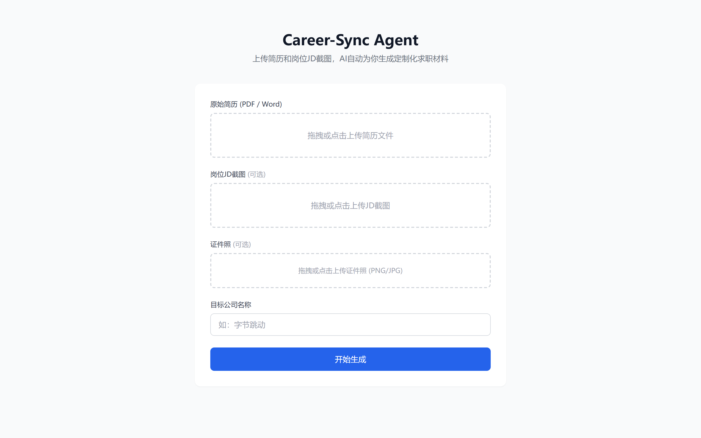
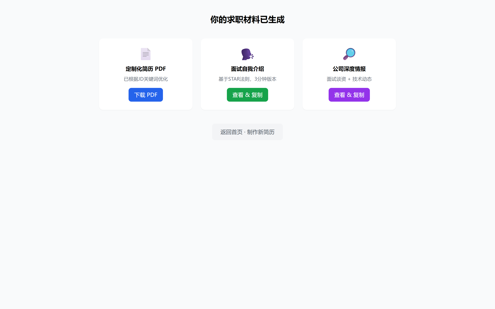

<p align="center">
  <h1 align="center">CareerSync Agent</h1>
  <p align="center"><strong>AI 驱动的智能求职助手</strong></p>
  <p align="center">
    
    
    
    
    
  </p>
</p>

---

<p align="center">
  
</p>

## 目录

- [它能做什么](#它能做什么)
- [流水线架构](#流水线架构)
- [快速开始](#快速开始)
- [项目结构](#项目结构)
- [模型策略](#模型策略)
- [简历字段覆盖](#简历字段覆盖)
- [常见问题](#常见问题)
- [License](#license)

## 它能做什么

你只需要提供 **原始简历** 和 **目标岗位 JD 截图**（可选），Agent 会自动完成以下全部工作：

| 阶段 | 交付物 | 描述 |
|:---:|------|------|
| **M0** | 结构化简历 JSON | 解析 PDF / Word，提取姓名、教育、技能、经历、项目、获奖等全部信息 |
| **M1** | JD 技能画像 | 多模态视觉模型识别 BOSS / 猎聘截图中的技术栈、业务方向、硬性要求 |
| **M2** | 定制化 A4 PDF 简历 | STAR 法则重写经历（有 JD 则定向裁剪，无 JD 则内容润色），单页 A4 排版 |
| **M3** | 面试自我介绍 + 公司报告 | 3 分钟口语化话术 + 目标公司概况、技术栈、面试谈资（带来源标注） |

<p align="center">
  
</p>

### 使用场景

```
有 JD：简历解析 → JD 技能提取 → 经历对齐改写 → 定向裁剪 PDF → 面试材料
无 JD：简历解析 → 内容润色优化 → STAR 法则重写 → 通用优化 PDF
```

JD 截图不是必须的。不上传 JD 时，系统会对简历做内容润色（量化成果、动词优化、技术名词规范化），不删减任何原始信息。

## 流水线架构

```
┌──────────┐    ┌──────────┐    ┌──────────┐    ┌──────────┐
│   M0     │    │   M1     │    │   M2     │    │   M3     │
│ 简历解析  │───▶│ JD 识别  │───▶│ 内容生成  │───▶│ 面试辅助  │
│          │    │          │    │          │    │          │
│ PDF/Word │    │ 截图OCR  │    │ 简历改写  │    │ 自我介绍  │
│  → JSON  │    │  → 关键词 │    │  → PDF   │    │ 公司情报  │
└──────────┘    └──────────┘    └──────────┘    └──────────┘
     ✅              ✅              ✅              ✅
  PyMuPDF      Kimi k2.6       DeepSeek        Bing ↓
  python-docx   多模态视觉     STAR 法则    DuckDuckGo ↓
  DeepSeek                    Playwright     LLM 回退
```

每一步都通过 WebSocket 向浏览器实时推送进度，全程可视。

## 快速开始

### 环境要求

- Python 3.10+
- Windows / macOS / Linux

### 安装

```bash
# 克隆项目
git clone https://github.com/HR-Xie/career-sync-agent.git
cd career-sync-agent

# 创建虚拟环境
python -m venv venv
source venv/Scripts/activate   # Windows (Git Bash)
# source venv/bin/activate     # macOS / Linux

# 安装依赖
pip install -r requirements.txt
playwright install chromium
```

### 配置 API Key

```bash
cp .env.example .env
```

编辑 `.env`，填入你的 API Key：

```ini
DEEPSEEK_API_KEY=sk-xxx    # 必填，文本生成主力模型
KIMI_API_KEY=sk-xxx        # 必填，JD 截图视觉识别
```

> 公司情报搜索使用免费的 Bing / DuckDuckGo，不需要额外 API Key。

### 启动服务

```bash
python main.py
```

浏览器打开 **http://localhost:8000**，上传简历即可开始使用。

### 使用步骤

1. 上传原始简历（PDF 或 Word，必填）
2. 上传目标岗位 JD 截图（可选）
3. 上传证件照（可选）
4. 填写目标公司名称（可选，用于公司情报搜索）
5. 点击「开始生成」，等待 AI 处理完成
6. 下载定制化 PDF 简历，查看面试材料和公司情报

## 项目结构

```
career-sync-agent/
├── main.py                     # FastAPI 应用入口
├── config.py                   # 环境变量与配置管理
├── worker.py                   # 异步任务执行引擎
│
├── api/
│   ├── schemas.py              # Pydantic 请求/响应模型
│   └── routes/
│       ├── upload.py           # 文件上传接口
│       ├── generate.py         # 任务创建 / 状态查询 / 下载
│       └── ws.py               # WebSocket 进度推送
│
├── services/
│   ├── parser.py               # PDF / Word 文本提取 + 图片压缩
│   ├── generator.py            # Prompt 拼接 + Jinja2 HTML 渲染
│   ├── renderer.py             # Playwright HTML → A4 单页 PDF
│   └── orchestrator.py         # M0 → M3 流水线调度
│
├── llm/
│   ├── client.py               # AsyncOpenAI 异步客户端（非阻塞）
│   ├── fallback.py             # 主备模型路由 + 指数退避重试
│   └── prompts.py              # 7 个结构化 Prompt 模板
│
├── search/
│   └── web.py                  # 公司情报三级搜索回退
│
├── templates/
│   ├── pages/                  # 三个 Web 页面（Tailwind CSS）
│   │   ├── index.html          #   上传页
│   │   ├── progress.html       #   进度页（WebSocket 实时更新）
│   │   └── result.html         #   结果页（PDF + 面试材料）
│   └── resumes/                # 简历 HTML 模板 + 5 个可复用组件
│
└── tests/                      # 32 个单元 + 集成测试
```

## 模型策略

项目采用 **主备切换 + 自动回退** 的双模型架构：

| 任务 | 主力模型 | 备用模型 | 策略 |
|------|----------|----------|------|
| 文本生成 | DeepSeek V4 Pro | Kimi k2.6 | 超时或失败自动切换，指数退避重试 |
| 视觉识别 | Kimi k2.6 | — | JD 截图专用，无备选 |

文本类任务通过 `LLMRouter` 统一调度：先调用主力模型，遇到网络波动或限流时自动回退到备用模型，重试间隔 1s → 2s → 4s。

## 简历字段覆盖

从原始简历中提取并保留以下全部字段，无删减：

```
姓名  邮箱  电话  证件照
├── 教育背景：学校 · 学位 · 专业 · 时间 · 主修课程
├── 技能列表
├── 工作/实习经历：公司 · 岗位 · 时间 · 亮点 (STAR)
├── 项目经历：名称 · 描述 · 技术栈 · 成果 · 开源地址
├── 校园经历：组织 · 角色 · 时间 · 亮点
├── 获奖荣誉
├── 证书资格
└── 论文发表：标题 · 发表渠道 · 年份
```

## 常见问题

<details>
<summary><strong>不传 JD 截图会怎样？</strong></summary>
<br>
系统自动切换为「内容优化模式」，对简历进行 STAR 法则改写、动词精准化、技术名词规范化，不做 JD 定向裁剪。所有原始信息完整保留。
</details>

<details>
<summary><strong>生成的 PDF 为什么只有一页？</strong></summary>
<br>
模板通过 CSS <code>@page { size: A4 }</code> + <code>max-height</code> 约束强制单页，字号、行距、边距经过反复调优。如果内容实在过多，LLM 会在重写阶段自动精简表达。
</details>

<details>
<summary><strong>需要什么 API Key？</strong></summary>
<br>
至少需要 DeepSeek + Kimi 两组 Key。DeepSeek 用于文本生成（简历解析/改写/话术），Kimi 用于 JD 截图识别。公司搜索走免费搜索引擎，不需要 Key。
</details>

<details>
<summary><strong>支持哪些简历格式？</strong></summary>
<br>
PDF（.pdf）和 Word（.docx）。旧版 .doc 格式请先用 Word 另存为 .docx。
</details>

## License

MIT © HR-Xie

---

<p align="center">
  <sub>Built with Python · FastAPI · DeepSeek · Kimi · Playwright</sub>
</p>
